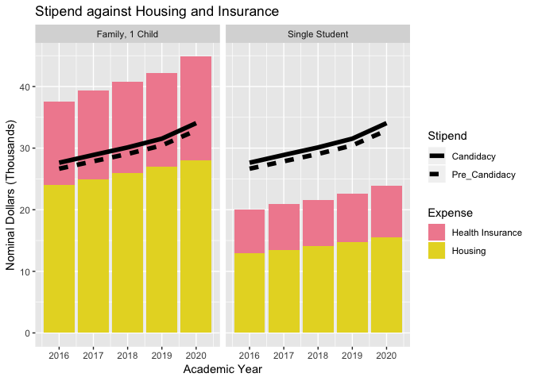
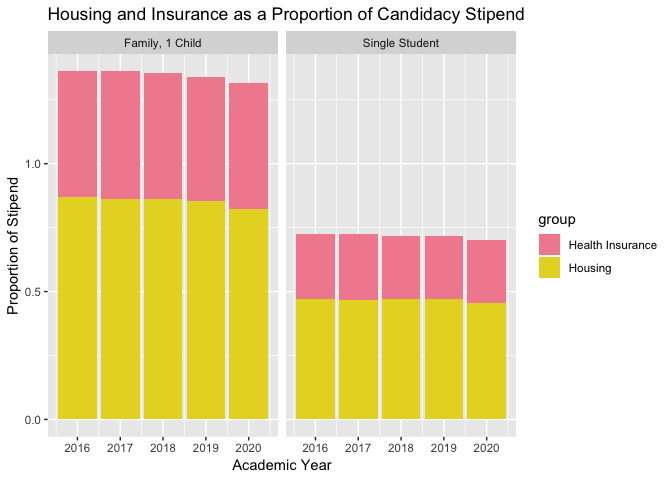
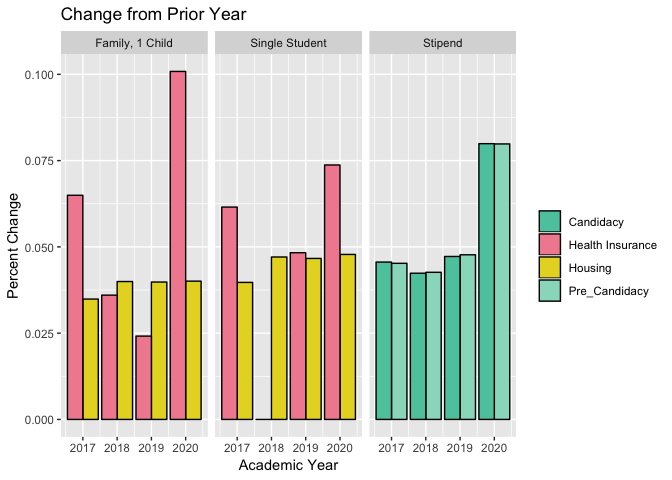

Cost of Living for GSE Grad Students
================

# Project Overview

This project documents cost of living for graduate students at the
Stanford GSE. Data was collected using the Stanford website and the
[wayback machine](http://web.archive.org). Data is collected in
`raw/Stanford Cost of Living.xlsx`. PDFcopies of webpages referenced are
available in `raw/documentation`.

Current data available is:

  - Student Stipend, 2011-12 and 2014-15 through 2019-20
  - Meal Plans, 2017-18 through 2019-20
  - Health Insurance, 2015-16 through 2019-20
  - Housing 2015-16 through 2019-20

# Sample Analysis

This document summarizes data on the change in health insurance, and
housing costs against the changes in the student stipend for GSE
graduate students. I examine a single student and a family with one
child. For the single student we assume the housing is a shared 2
bedroom, one bath unit. For the family we assume that the housing is
also a 2 bedroom, 1 bath unit. For health insurance I include the full
50% subsidy and free summer quarter for the student, and the annualized
monthly cost for a spouse and one child. The stipend is the annualized
amount for three terms, and does not include any additional earnings
from the summer quarter. All figures shown for the stipend are pre-tax.

## Nominal Costs over Time

<!-- -->

## Costs as a Proportion of the Stipend

<!-- -->

## Annual Percent Change

<!-- -->

## Tables

| type            | Year | Health Insurance | Housing |
| :-------------- | ---: | ---------------: | ------: |
| Single Student  | 2016 |             7020 |   12996 |
| Single Student  | 2017 |             7452 |   13512 |
| Single Student  | 2018 |             7452 |   14148 |
| Single Student  | 2019 |             7812 |   14808 |
| Single Student  | 2020 |             8388 |   15516 |
| Family, 1 Child | 2016 |            13513 |   24084 |
| Family, 1 Child | 2017 |            14390 |   24924 |
| Family, 1 Child | 2018 |            14909 |   25920 |
| Family, 1 Child | 2019 |            15269 |   26952 |
| Family, 1 Child | 2020 |            16808 |   28032 |

Insurance and Housing Cost (Nominal Dollars)

| Year | Pre\_Candidacy | Candidacy |
| ---: | -------------: | --------: |
| 2016 |          26658 |     27630 |
| 2017 |          27864 |     28890 |
| 2018 |          29052 |     30114 |
| 2019 |          30438 |     31536 |
| 2020 |          32868 |     34056 |

Student Stipend (Nominal Dollars)

| Year | Health Insurance | Housing |
| ---: | ---------------: | ------: |
| 2016 |             0.25 |    0.47 |
| 2017 |             0.26 |    0.47 |
| 2018 |             0.25 |    0.47 |
| 2019 |             0.25 |    0.47 |
| 2020 |             0.25 |    0.46 |

Costs as proportion of candidacy stipend, for a single student

| Year | Health Insurance | Housing |
| ---: | ---------------: | ------: |
| 2016 |             0.49 |    0.87 |
| 2017 |             0.50 |    0.86 |
| 2018 |             0.50 |    0.86 |
| 2019 |             0.48 |    0.85 |
| 2020 |             0.49 |    0.82 |

Costs as proportion of candidacy stipend, for a family with 1 child
